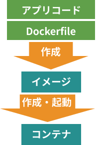
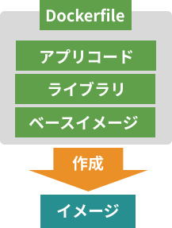

# Docker超入門講座 合併版 | ゼロから実践する4時間のフルコース

> [学習教材動画](https://youtu.be/lZD1MIHwMBY)
> [00:00:0](https://www.youtube.com/watch?v=lZD1MIHwMBY&t=0s)　オープニング & Dockerって何？
> [00:04:16](https://www.youtube.com/watch?v=lZD1MIHwMBY&t=256s)　環境構築 for Mac
> [00:14:27](https://www.youtube.com/watch?v=lZD1MIHwMBY&t=867s)　環境構築 for Windows
> [00:34:53](https://www.youtube.com/watch?v=lZD1MIHwMBY&t=2093s)　Linuxの基本コマンド
> [00:47:40](https://www.youtube.com/watch?v=lZD1MIHwMBY&t=2860s)　Dockerを使ってみよう
> [00:53:34](https://www.youtube.com/watch?v=lZD1MIHwMBY&t=3214s)　アプリを作成・実行しよう 
> [01:15:04](https://www.youtube.com/watch?v=lZD1MIHwMBY&t=4504s)　Dockerfileを作ろう 
> [01:36:37](https://www.youtube.com/watch?v=lZD1MIHwMBY&t=5797s)　Docker ComposeでRailsを構築しよう
> [01:59:20](https://www.youtube.com/watch?v=lZD1MIHwMBY&t=7160s)　本番環境に公開しよう
> [02:49:17](https://www.youtube.com/watch?v=lZD1MIHwMBY&t=10157s)　CI/CDを構築しよう 
>
> ■ソースコード
「アプリを作成・実行しよう」
https://github.com/kiyodori/rails-docker-kyt/tree/main/sample/05_CREATE_APP
> 
> 「Dockerfileを作ろう」
> https://github.com/kiyodori/rails-docker-kyt/tree/main/sample/06_DOCKERFILE
>
> 「Docker ComposeでRailsを構築しよう」〜「CI/CDを構築しよう」
> （最終版でひとまとめにしております）
> https://github.com/kiyodori/rails-docker-kyt

## hello-worldから始めてみる
https://youtu.be/lZD1MIHwMBY?t=2913

```bash
$ docker run hello-world

Unable to find image 'hello-world:latest' locally
latest: Pulling from library/hello-world
719385e32844: Pull complete 
Digest: sha256:fc6cf906cbfa013e80938cdf0bb199fbdbb86d6e3e013783e5a766f50f5dbce0
Status: Downloaded newer image for hello-world:latest

Hello from Docker!
This message shows that your installation appears to be working correctly.

To generate this message, Docker took the following steps:
 1. The Docker client contacted the Docker daemon.
 2. The Docker daemon pulled the "hello-world" image from the Docker Hub.
    (amd64)
 3. The Docker daemon created a new container from that image which runs the
    executable that produces the output you are currently reading.
 4. The Docker daemon streamed that output to the Docker client, which sent it
    to your terminal.

To try something more ambitious, you can run an Ubuntu container with:
 $ docker run -it ubuntu bash

Share images, automate workflows, and more with a free Docker ID:
 https://hub.docker.com/

For more examples and ideas, visit:
 https://docs.docker.com/get-started/

$ docker image ls
REPOSITORY    TAG          IMAGE ID       CREATED       SIZE
php           8.2-apache   c7e8ea333e39   2 weeks ago   460MB
php           apache       c7e8ea333e39   2 weeks ago   460MB
hello-world   latest       9c7a54a9a43c   5 weeks ago   13.3kB
php           7.2-apache   c61d277263e1   2 years ago   410MB

```

### docker run hello-worldして帰ってきたメッセージが、あまりに親切で温かったので和訳を記録しておきます

画像「hello-world:latest」をローカルで見つけることができません。
最新版です： ライブラリ/hello-worldからプルする
719385e32844: プル完成 
Digest: sha256:fc6cf906cbfa013e80938cdf0bb199fbdbb86d6e3e013783e5a766f50f5dbce0
ステータス hello-world:latestの新しいイメージがダウンロードされました。

Hello from Docker!
このメッセージは、インストールが正しく動作しているように見えることを示します。

このメッセージを生成するために、Dockerは以下のステップを踏んでいます：
 1. DockerクライアントがDockerデーモンに連絡した。
 2. DockerデーモンがDocker Hubから「hello-world」イメージを取り出した。
    (amd64)
 3. Dockerデーモンは、そのイメージから新しいコンテナを作成し、そのコンテナで、あなたが出力する実行ファイルを実行します。
    実行ファイルを実行し、現在読んでいる出力を生成します。
 4. Dockerデーモンは、その出力をDockerクライアントにストリーミングし、クライアントはその出力をあなたの端末に送信します。
    に送信します。

もっと野心的なことを試すには、次のようにしてUbuntuコンテナを実行します：
  ```$ docker run -it ubuntu bash```

無料のDocker IDで、イメージの共有、ワークフローの自動化など、さまざまなことができます：
 https://hub.docker.com/

その他の例やアイデアについては、以下をご覧ください：
 https://docs.docker.com/get-started/

## Dockerの基本操作を覚える

https://www.youtube.com/watch?v=lZD1MIHwMBY&t=3214s

<b>アプリ作成からコンテナ起動までの基本的な流れ</b>



---

<b>Dockerfileにより、コンテナの元となるイメージをつくる作業の流れ</b>





上の図の順番に沿って以下に演習をおこなう

### 1. アプリ(ケーションの)コードを準備する

ここでは、「rubyでWebサーバー作り、トップページにアクセスされたら”hello"と返す」アプリとします。

#### (1) 作業用ディレクトリを作成、指定する

ここではlearninディレクトリ直下に「docker」というディレクトリを作り、そこを作業場（アプリのルート）とします。

#### (2) アプリのルートにmain.rbというアプリコードファイルを作る

```ruby=
require 'webrick'

server = WEBric::HTTPSerer.new(
  DocumentRoot: './',
  BindAddres: '0.0.0.0',
  Port: 8000
)

server.mount_proc('/') do |req, res|
  res.body = 'hello'
end

server.start
```